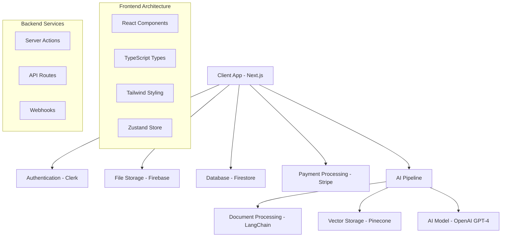

# 📄 PDF Toolkit

> **Transform your PDFs into interactive conversations with AI-powered intelligence**

A modern SaaS application that revolutionizes how users interact with PDF documents through intelligent AI chat functionality, built with enterprise-grade architecture and cutting-edge technologies.

[](https://nextjs.org/)
[](https://www.typescriptlang.org/)
[](https://tailwindcss.com/)
[](https://firebase.google.com/)
[](https://stripe.com/)

## 🚀 Live Demo

**[View Live Application →](https://chat-with-pdf-challenge-peach.vercel.app/)**

*Experience the power of AI-driven PDF interaction firsthand*

## 📋 Table of Contents

- [🎯 Overview](#-overview)
- [✨ Key Features](#-key-features)
- [🛠️ Technology Stack](#️-technology-stack)
- [🏗️ Architecture](#️-architecture)
- [🚀 Getting Started](#-getting-started)
- [📱 Usage](#-usage)
- [🔧 Configuration](#-configuration)
- [🧪 Testing](#-testing)
- [📈 Performance](#-performance)
- [🔒 Security](#-security)
- [📦 Deployment](#-deployment)
- [🤝 Contributing](#-contributing)
- [📄 License](#-license)

## 🎯 Overview

PDF Toolkit is a sophisticated SaaS platform that bridges the gap between static document viewing and dynamic interaction. By leveraging advanced AI technologies, users can engage in natural conversations with their PDF documents, extracting insights, summaries, and answers with unprecedented ease.

### 🎨 Design Philosophy

- **User-Centric**: Intuitive interface designed for seamless user experience
- **Performance-First**: Optimized for speed and responsiveness across all devices
- **Enterprise-Ready**: Scalable architecture with robust security measures
- **Modern Stack**: Built with cutting-edge technologies and best practices

## ✨ Key Features

### 🤖 **Intelligent AI Chat**
- **Natural Language Processing**: Ask questions in plain English and receive contextual answers
- **Memory Retention**: AI remembers conversation history for coherent, ongoing discussions
- **Multi-Document Support**: Chat with multiple PDFs while maintaining context

### 📁 **Document Management**
- **Secure Cloud Storage**: Documents safely stored with Firebase infrastructure
- **Interactive PDF Viewer**: Advanced viewer with zoom, rotation, and navigation controls
- **Real-time Processing**: Instant document analysis and embedding generation

### 💳 **Subscription Management**
- **Flexible Pricing Tiers**: Free and Pro plans with clear feature distinctions
- **Stripe Integration**: Secure payment processing and subscription management
- **Usage Analytics**: Track document limits and chat message quotas

### 🎨 **User Experience**
- **Responsive Design**: Flawless experience across desktop, tablet, and mobile devices
- **Dark/Light Mode**: Customizable themes for user preference
- **Real-time Updates**: Live chat updates and document synchronization
- **Progressive Loading**: Smart loading states and error handling

## 🛠️ Technology Stack

### **Frontend**
- **Framework**: Next.js 15 with App Router
- **Language**: TypeScript (100% type-safe)
- **Styling**: Tailwind CSS + Shadcn/UI Components
- **State Management**: Zustand for client-side state
- **PDF Rendering**: React-PDF for document visualization

### **Backend & Services**
- **Authentication**: Clerk for secure user management
- **Database**: Firebase Firestore (NoSQL)
- **File Storage**: Firebase Cloud Storage
- **Vector Database**: Pinecone for AI embeddings
- **AI/ML**: OpenAI GPT-4 + LangChain framework

### **Infrastructure**
- **Hosting**: Vercel (optimized for Next.js)
- **Payments**: Stripe for subscription billing
- **Monitoring**: Built-in error handling and logging

### **Development Tools**
- **Package Manager**: npm
- **Linting**: ESLint with strict rules
- **Code Formatting**: Prettier integration
- **Version Control**: Git with conventional commits

## 🏗️ Architecture



### **Data Flow**

1. **Document Upload**: Files uploaded to Firebase Storage with metadata stored in Firestore
2. **AI Processing**: PDFs processed through LangChain pipeline, generating embeddings stored in Pinecone
3. **Chat Interaction**: User queries processed through context-aware retrieval chain
4. **Real-time Updates**: Firebase listeners provide instant UI updates

## 🚀 Getting Started

### **Prerequisites**

Ensure you have the following installed:
- **Node.js** (v18 or later)
- **npm** or **yarn**
- **Git**

### **Environment Setup**

1. **Clone the repository**
```bash
git clone https://github.com/ciaranjmcg0v/pdf-toolkit.git
cd pdf-toolkit
```

2. **Install dependencies**
```bash
npm install
```

3. **Configure environment variables**
```bash
cp .env.example .env.local
```

Required environment variables:
```env
# Authentication
NEXT_PUBLIC_CLERK_PUBLISHABLE_KEY=your_clerk_publishable_key
CLERK_SECRET_KEY=your_clerk_secret_key

# Firebase Configuration
NEXT_PUBLIC_FIREBASE_CONFIG=your_firebase_config_json
SERVICE_KEY=your_firebase_service_key_json
FIREBASE_STORAGE_BUCKET=your_storage_bucket

# AI Services
OPENAI_API_KEY=your_openai_api_key
PINECONE_API_KEY=your_pinecone_api_key

# Payment Processing
STRIPE_API_KEY=your_stripe_secret_key
NEXT_PUBLIC_STRIPE_PUBLISHABLE_KEY=your_stripe_publishable_key
STRIPE_WEBHOOK_SECRET=your_webhook_secret
```

4. **Start development server**
```bash
npm run dev
```

Visit `http://localhost:3000` to see the application running.

## 📱 Usage

### **Getting Started Guide**

1. **Sign Up**: Create an account using Clerk authentication
2. **Upload Document**: Drag and drop a PDF file to begin processing
3. **Wait for Processing**: AI embeddings are generated automatically
4. **Start Chatting**: Ask questions about your document content
5. **Manage Subscription**: Upgrade to Pro for enhanced features

### **Feature Walkthrough**

#### **Document Upload**
- Support for PDF files up to 10MB
- Real-time upload progress with status indicators
- Automatic AI processing and embedding generation

#### **AI Chat Interface**
- Natural language question input
- Contextual responses based on document content
- Chat history preservation across sessions

#### **Subscription Management**
- **Free Tier**: 2 documents, 3 messages per document
- **Pro Tier**: 20 documents, 100 messages per document
- Easy upgrade/downgrade through Stripe portal

## 🔧 Configuration

### **Firebase Setup**

1. Create a Firebase project
2. Enable Firestore and Storage
3. Configure authentication rules
4. Add service account credentials

### **Pinecone Configuration**

1. Create Pinecone account and index
2. Configure vector dimensions (1536 for OpenAI)
3. Set up namespacing for multi-tenant architecture

### **Stripe Integration**

1. Set up Stripe account with products
2. Configure webhooks for subscription events
3. Test with Stripe test cards

## 📈 Performance

### **Optimization Strategies**

- **Code Splitting**: Route-based and component-based splitting
- **Image Optimization**: Next.js Image component with WebP support
- **Caching**: Strategic use of Next.js caching mechanisms
- **Bundle Analysis**: Regular monitoring of bundle size

### **Performance Metrics**

- **First Contentful Paint**: < 1.5s
- **Largest Contentful Paint**: < 2.5s
- **Cumulative Layout Shift**: < 0.1
- **Time to Interactive**: < 3.5s

## 🔒 Security

### **Security Measures**

- **Authentication**: Secure JWT-based authentication with Clerk
- **Authorization**: Role-based access control
- **Data Encryption**: End-to-end encryption for sensitive data
- **Input Validation**: Comprehensive validation and sanitization
- **HTTPS**: Enforced SSL/TLS encryption

### **Privacy Compliance**

- GDPR compliant data handling
- User data retention policies
- Secure file deletion procedures

## 📦 Deployment

### **Vercel Deployment** (Recommended)

1. **Connect repository** to Vercel
2. **Configure environment variables** in Vercel dashboard
3. **Deploy** with automatic builds on push

```bash
# Manual deployment
npm run build
vercel --prod
```

### **Alternative Platforms**

- **Netlify**: Configure build settings for Next.js
- **Railway**: Use provided Next.js template
- **AWS**: Deploy with Serverless Framework

## 🤝 Contributing

We welcome contributions! Please see our [Contributing Guidelines](CONTRIBUTING.md) for details.

### **Development Workflow**

1. Fork the repository
2. Create a feature branch (`git checkout -b feature/amazing-feature`)
3. Commit changes (`git commit -m 'Add amazing feature'`)
4. Push to branch (`git push origin feature/amazing-feature`)
5. Open a Pull Request

### **Code Standards**

- **TypeScript**: Strict type checking enabled
- **ESLint**: Zero warnings policy
- **Prettier**: Consistent code formatting
- **Conventional Commits**: Structured commit messages

## 📞 Contact & Support

- **Portfolio**: [Your Portfolio Website](https://hiyaitsciaran.com)
- **LinkedIn**: [Your LinkedIn Profile](https://www.linkedin.com/in/hiyaitsciaran)
- **GitHub**: [Your GitHub Profile](https://github.com/ciaranjmcg0v)
- **Email**: ciaranjmcgovern@gmail.com

## 📄 License

This project is licensed under the MIT License - see the [LICENSE](LICENSE) file for details.

---

<div align="center">

**Built with ❤️ using modern web technologies**

*Showcasing expertise in full-stack development, AI integration, and enterprise architecture*

</div>